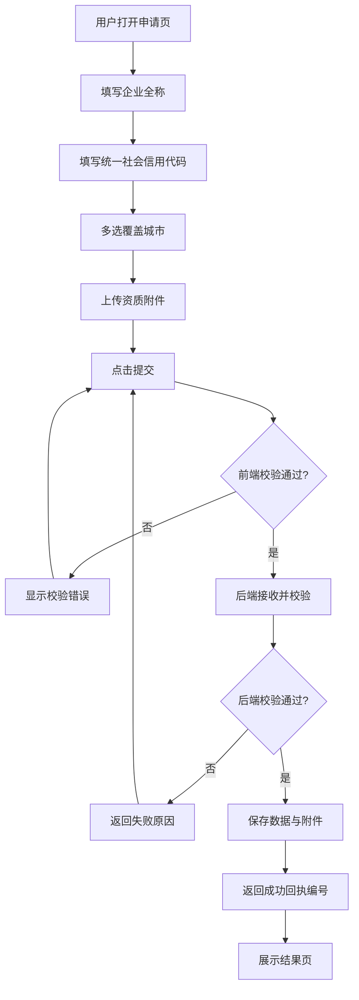

# 城市合伙人申请表 - 产品需求文档（PRD）

## 1. 产品概述
- 城市合伙人申请表用于意向合作企业在线提交资质信息，申请成为平台城市合伙人，覆盖企业信息采集与资质材料归档。
- 解决传统线下/邮件收集申请效率低、资质附件易丢失、信息难校验的问题，面向 B 端企业用户，提升合作准入的规范化与数字化水平。

## 2. 核心功能

### 2.1 用户角色
| 角色 | 注册方式 | 核心权限 |
|------|---------|---------|
| 申请企业 | 无需注册，直接填写提交 | 填写企业资质信息并上传附件、提交申请 |
| 平台运营 | 后台查看数据 | 查阅申请记录与附件（本期暂不实现后台界面） |

### 2.2 功能模块
1. **申请表单页**：企业全称、统一社会信用代码、覆盖城市、资质附件的填写与校验。
2. **提交结果反馈**：提交成功/失败的即时反馈，支持查看回执编号。

### 2.3 页面详情
| 页面名称 | 模块名称 | 功能描述 |
|---------|---------|---------|
| 申请表单页 | 品牌头部 | 品牌标识、标题、简短说明 |
| 申请表单页 | 企业信息 | 企业全称（必填）、统一社会信用代码（必填+格式校验） |
| 申请表单页 | 覆盖城市 | 多选城市标签，支持搜索过滤 |
| 申请表单页 | 资质附件 | 多文件拖拽上传，支持类型/大小校验 |
| 申请表单页 | 提交区 | 提交按钮、校验提示、重置 |
| 提交结果反馈 | 结果卡 | 成功回执编号 / 失败原因，返回继续 |

## 3. 核心流程
用户打开页面 → 填写企业全称与信用代码 → 多选覆盖城市 → 拖拽上传资质附件 → 点击提交 → 前端校验 → 后端校验并保存数据与附件 → 返回成功回执 → 用户查看结果。

## 4. 用户界面设计

### 4.1 设计风格
- **设计方向**：克制精致的编辑式商务风（Refined Editorial），传递可信赖与高端合作的气质，避免通用 SaaS 模板感。
- **主色**：深墨青 `#0E3B3A`（沉稳）+ 暖金 `#B8893A`（点缀/聚焦）。
- **背景**：暖米白纸质 `#F6F1E9`，搭配极淡噪点纹理增强质感。
- **按钮风格**：主按钮实色深墨青带暖金悬停微光；圆角 8px。
- **字体**：标题 Noto Serif SC（衬线，体现质感）；正文/UI Noto Sans SC（无衬线，清晰）。
- **布局**：单列居中卡片，最大宽度 640px，大量留白；左上品牌标识 + 右上步骤计数。
- **图标**：使用 lucide 图标，线性风格，与衬线标题形成对比。
- **动效**：加载时分区错峰淡入上移；输入框聚焦暖金描边；城市标签悬停微抬；拖拽区进入态高亮。

### 4.2 页面设计概览
| 页面名称 | 模块名称 | UI 元素 |
|---------|---------|---------|
| 申请表单页 | 品牌头部 | 衬线大标题、副标题、分隔细线 |
| 申请表单页 | 企业信息 | 下划线式输入框、字段说明、校验提示 |
| 申请表单页 | 覆盖城市 | 搜索框 + 标签芯片多选、已选区 |
| 申请表单页 | 资质附件 | 虚线拖拽区、文件列表（名称/大小/移除） |
| 申请表单页 | 提交区 | 主按钮、错误汇总、重置链接 |
| 提交结果反馈 | 结果卡 | 成功勾选图标、回执编号、返回按钮 |

### 4.3 响应式
- 桌面优先（≥1024px 居中卡片），平板/移动端自适应单列堆叠，触控热区 ≥44px，输入框避免 16px 以下字体防缩放。
