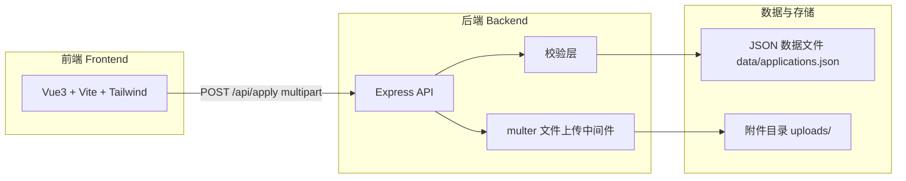
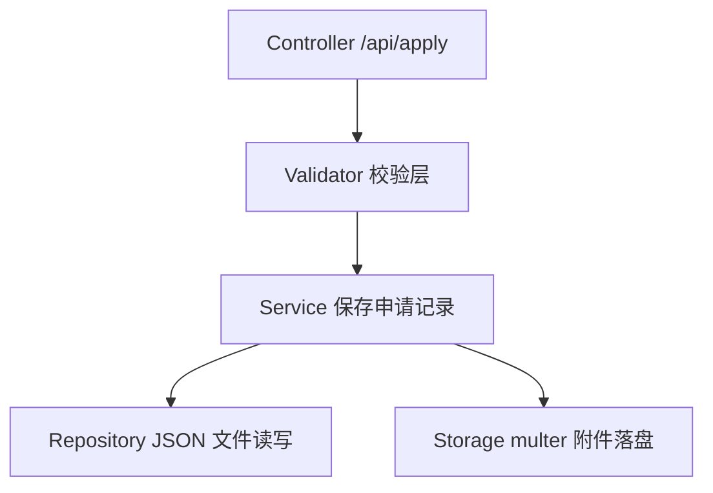
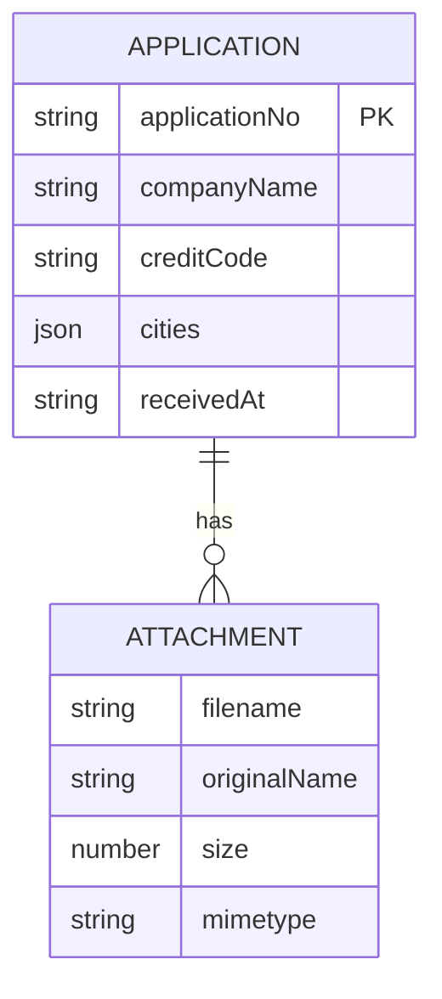

# 城市合伙人申请表 - 技术架构文档

## 1. 架构设计



## 2. 技术说明
- **前端**：Vue@3 + tailwindcss + vite（TypeScript）
- **初始化工具**：vite-init（模板 `vue-express-ts`，含 vue、vue-router、tailwind、express）
- **后端**：Express@4（ESM + TypeScript）
- **文件上传**：multer
- **数据存储**：本期使用 JSON 文件持久化（`api/data/applications.json`）+ 本地附件目录（`uploads/`），不引入数据库，便于演示与后续替换。

## 3. 路由定义
| 路由 | 用途 |
|------|------|
| `/` | 城市合伙人申请表单页 |

## 4. API 定义

### 4.1 提交申请
`POST /api/apply`（`multipart/form-data`）

请求字段：
| 字段 | 类型 | 必填 | 说明 |
|------|------|------|------|
| companyName | string | 是 | 企业全称 |
| creditCode | string | 是 | 统一社会信用代码（18 位，大写字母+数字） |
| cities | string (JSON 数组字符串) | 是 | 覆盖城市数组，如 `["北京市","上海市"]` |
| attachments | File[] | 是 | 资质附件，支持多文件，单个 ≤10MB，类型 pdf/jpg/png |

响应（成功）：
```ts
interface ApplyResponse {
  success: true;
  applicationNo: string; // 回执编号，如 CAP-20260619-xxxx
  receivedAt: string;     // ISO 时间
}
```
响应（失败）：
```ts
interface ApplyResponse {
  success: false;
  errors: { field: string; message: string }[];
}
```

### 4.2 健康检查
`GET /api/health` → `{ status: "ok" }`

### 4.3 城市列表
`GET /api/cities` → `{ cities: string[] }`（返回可选城市清单）

## 5. 服务架构图



## 6. 数据模型

### 6.1 数据模型定义


### 6.2 数据定义
JSON 记录结构（`applications.json` 数组元素）：
```json
{
  "applicationNo": "CAP-20260619-a1b2",
  "companyName": "示例科技有限公司",
  "creditCode": "91110108MA00ABCDEF",
  "cities": ["北京市", "上海市"],
  "receivedAt": "2026-06-19T10:00:00.000Z",
  "attachments": [
    { "filename": "u-xxxx.pdf", "originalName": "营业执照.pdf", "size": 234567, "mimetype": "application/pdf" }
  ]
}
```
